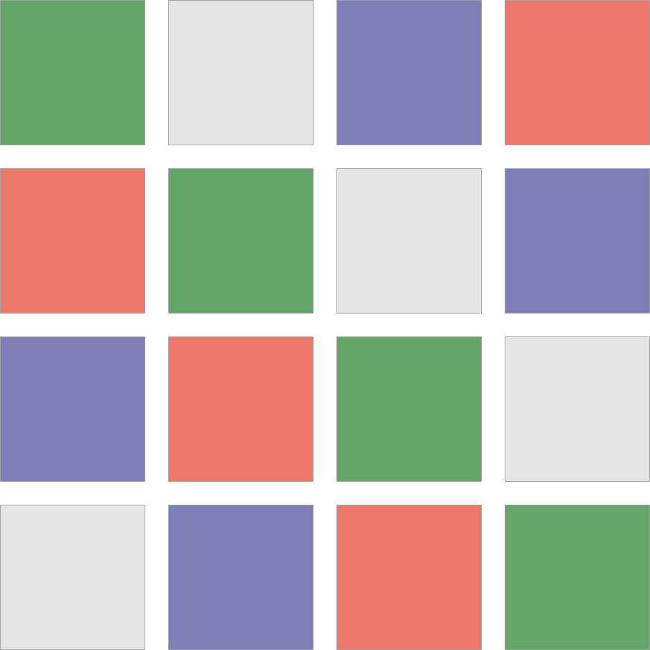
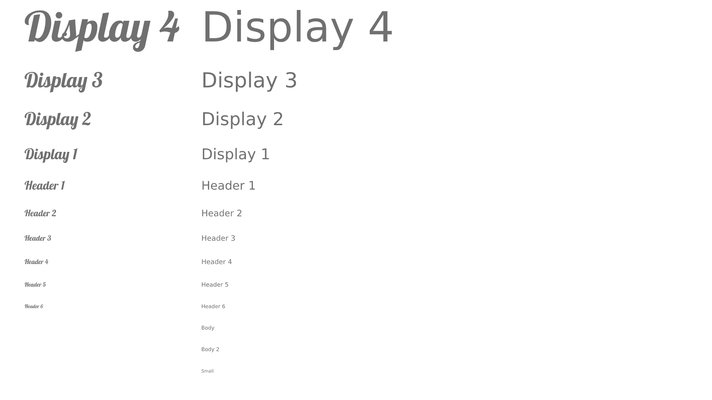

# Definições 

## Cores
- **Cor Principal:** #7f7fb8
- **Cor Secundária:** #66a568
- **Cor Alerta:** #eb786b
- **Cor Suplementar / Fundo:** #e5e5e5

## Tipografia
- **Fonte para títulos e subtitulos (h1, h2):** Lobster
- **Fonte para textos e títulos secundários (h3,h4,h5,h6,p,span):** Quicksand
