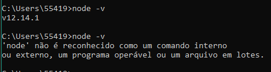
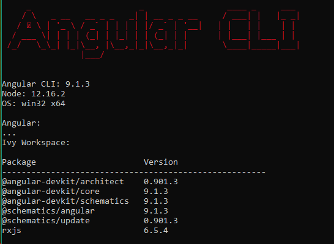

## Como Instalar
1. Instalação do NodeJS
	- Abra o CMD e digite ``` node -v```;
	- Caso seja diferente de 12.16.2, desinstale, caso não exista, apenas continue para o próximo passo;
	
	- Instale o node na versão 12.16.X (qualquer versão no X);
1. Instalação do Angular 9
	- ```npm install -g @angular/cli```;
	- Verifique que o @angular/cli foi instalado, rodando ```ng --version```;
	

1. Instalação do VsCode
	- Instale/Atualize seu VsCode;
	- Instale as seguintes extensões:
		- [Angular Language Service](https://marketplace.visualstudio.com/items?itemName=Angular.ng-template)
		- [Better Comments](https://marketplace.visualstudio.com/items?itemName=aaron-bond.better-comments)
		- [Bookmarks](https://marketplace.visualstudio.com/items?itemName=alefragnani.Bookmarks)
		- [Debugger for Chrome](https://marketplace.visualstudio.com/items?itemName=msjsdiag.debugger-for-chrome)
		- [GitLens](https://marketplace.visualstudio.com/items?itemName=eamodio.gitlens)
		- [Material Icon Theme](https://marketplace.visualstudio.com/items?itemName=PKief.material-icon-theme)
		- [One Monokai Theme](https://marketplace.visualstudio.com/items?itemName=azemoh.one-monokai)
		- [Path Intellisense](https://marketplace.visualstudio.com/items?itemName=christian-kohler.path-intellisense)
		- [Scss Formatter](https://marketplace.visualstudio.com/items?itemName=sibiraj-s.vscode-scss-formatter)
		- [TSLint](https://marketplace.visualstudio.com/items?itemName=ms-vscode.vscode-typescript-tslint-plugin)
		- [Typescript Hero](https://marketplace.visualstudio.com/items?itemName=rbbit.typescript-hero)
		- [Google Translate](https://marketplace.visualstudio.com/items?itemName=funkyremi.vscode-google-translate)
		- [Prettier](https://marketplace.visualstudio.com/items?itemName=esbenp.prettier-vscode)
